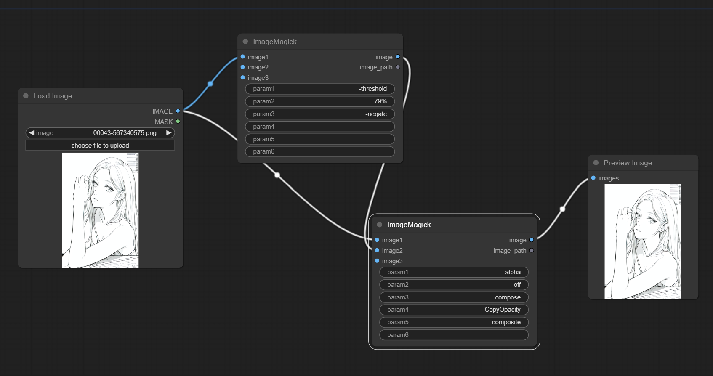

# ComfyUI ImageMagick

**ComfyUI ImageMagick** is an extension implements custom nodes that integrated [ImageMagick](https://imagemagick.org/index.php) into ComfyUI.

[ImageMagick](https://imagemagick.org/index.php) is an extremely powerful image processing tool, and you can even think of it as a command-line version of "Photoshop". This Custom Nodes plugin allows you to integrate ImageMagick into your ComfyUI workflow.

## Installation

First, install [ImageMagick 7.x](https://imagemagick.org/script/download.php) on your local and ensure that you can run the 'magick' command in the command line. 

Then, just like installing other ComfyUI plugins, run 'git clone' in the custom_nodes directory.

## How to use
This plugin implements a custom node `ImageMagick`. 

In the command line, theoretically, you can add unlimited image inputs and parameters. 

In the current version of this plugin, the node allows up to 3 image inputs and 6 parameters. 

If you find this number insufficient, please open an issue to inform me.

## Why did I think of doing this?
Initially, it was because I generated black and white line art in stable diffusion, and then I wanted to turn the line art into transparent backgrounds. Of course, I could do this in Photoshop, but isn't there a faster way? That's when I discovered ImageMagick.

With just two commands in ImageMagick, you can achieve this:
- `magick input.png -threshold 70% -negate mask.png`
- `magick input.png mask.png -alpha off -compose CopyOpacity -composite output.png`

By adjusting the `threshold`, you can control the intensity of the line art.

Then, I thought, why not directly generate transparent line art in ComfyUI? That led to the idea of integrating ImageMagick into ComfyUI.

## Examples
Here, I provide two workflows, mainly to implement the above two commands in ComfyUI:
1. [workflows1.xml](workflows/example-workflow1.json) 
2. [workflows2.xml](workflows/example-workflow2.json) 

And output:

It must be said that ImageMagick can achieve more powerful functionalities, and for specific usage, please refer to the ImageMagick official [documentation](https://imagemagick.org/script/magick.php).

## Credit
- [ImageMagick](https://imagemagick.org/index.php) - ImageMagick® is a free, open-source software suite, used for editing and manipulating digital images.
- [ComfyUI](https://github.com/comfyanonymous/ComfyUI) - A powerful and modular stable diffusion GUI.

## My extensions for ComfyUI
- [ComfyUI-InstantMesh](https://github.com/jtydhr88/ComfyUI-InstantMesh) - ComfyUI InstantMesh is custom nodes that running InstantMesh into ComfyUI
- [ComfyUI-ImageMagick](https://github.com/jtydhr88/ComfyUI-ImageMagick) - This extension implements custom nodes that integreated ImageMagick into ComfyUI
- [ComfyUI-Workflow-Encrypt](https://github.com/jtydhr88/ComfyUI-Workflow-Encrypt) - Encrypt your comfyui workflow with key

## My extensions for stable diffusion webui
- [3D Model/pose loader](https://github.com/jtydhr88/sd-3dmodel-loader) A custom extension for AUTOMATIC1111/stable-diffusion-webui that allows you to load your local 3D model/animation inside webui, or edit pose as well, then send screenshot to txt2img or img2img as your ControlNet's reference image.
- [Canvas Editor](https://github.com/jtydhr88/sd-canvas-editor) A custom extension for AUTOMATIC1111/stable-diffusion-webui that integrated a full capability canvas editor which you can use layer, text, image, elements and so on, then send to ControlNet, basing on Polotno.
- [StableStudio Adapter](https://github.com/jtydhr88/sd-webui-StableStudio) A custom extension for AUTOMATIC1111/stable-diffusion-webui to extend rest APIs to do some local operations, using in StableStudio.
- [Txt/Img to 3D Model](https://github.com/jtydhr88/sd-webui-txt-img-to-3d-model) A custom extension for sd-webui that allow you to generate 3D model from txt or image, basing on OpenAI Shap-E.
- [3D Editor](https://github.com/jtydhr88/sd-webui-3d-editor) A custom extension for sd-webui that with 3D modeling features (add/edit basic elements, load your custom model, modify scene and so on), then send screenshot to txt2img or img2img as your ControlNet's reference image, basing on ThreeJS editor.
